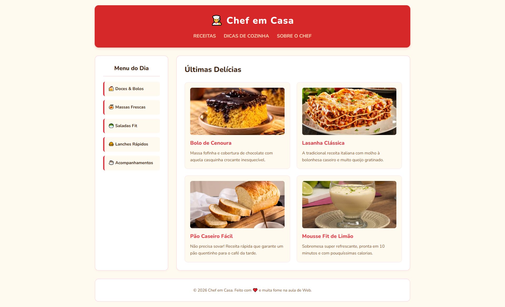
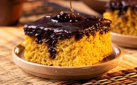

# 👨‍🍳 Chef em Casa

> **Um blog de culinária desenvolvido para praticar fundamentos de desenvolvimento Web, estruturação semântica, estilização com CSS e construção de interfaces modernas e responsivas.**

<div align="center">



<br>

### 🍰 Receitas • 🍝 Massas • 🥗 Saladas • 🍔 Lanches
    
<a href="https://gustavwebcriador.github.io/blog-culinaria/" target="_blank">

</a>


</div>

---

## 📖 Sobre o projeto

**Chef em Casa** é um projeto de desenvolvimento Web criado como atividade prática da disciplina de **Programação para Internet I**, no **IFSC – Campus Canoinhas**.

A proposta foi desenvolver uma página temática de culinária utilizando tecnologias fundamentais da Web, aplicando conceitos de **HTML5, CSS3, estrutura semântica, organização de layout, tipografia, cores, imagens e experiência visual**.

Mais do que apresentar receitas, o projeto foi desenvolvido com foco em transformar uma ideia simples em uma interface organizada, agradável e visualmente consistente.

O resultado é uma página que simula a home de um blog culinário, contendo:

* 🧁 Identidade visual própria;
* 🧭 Menu de navegação;
* 📂 Categorias de receitas;
* 🍽️ Área de receitas em destaque;
* 🖼️ Imagens reais dos pratos;
* ✨ Animações e efeitos de interação;
* 📱 Estrutura preparada para diferentes tamanhos de tela;
* 🧩 Organização do código separando estrutura, estilo e recursos.

---

## 🎯 Objetivos

O desenvolvimento do projeto teve como principais objetivos:

* Praticar a criação de páginas utilizando **HTML5**;
* Aplicar **CSS3** para construção de interfaces;
* Trabalhar com **CSS Grid e Flexbox**;
* Utilizar elementos HTML de forma semântica;
* Desenvolver uma identidade visual consistente;
* Trabalhar com imagens e recursos locais;
* Criar componentes visuais reutilizáveis através de classes CSS;
* Aplicar conceitos de responsividade;
* Praticar organização de arquivos em um projeto Web;
* Utilizar **Git e GitHub** para versionamento e publicação do projeto.

---

## 🖥️ Interface

A interface foi pensada para proporcionar uma experiência simples e intuitiva.

A estrutura principal utiliza um **layout em Grid**, dividido entre uma barra lateral de categorias e uma área principal destinada às receitas.

O cabeçalho ocupa toda a largura do conteúdo e apresenta a identidade do projeto juntamente com o menu de navegação.

## 🍽️ Funcionalidades

### 🧭 Navegação

O projeto possui um cabeçalho centralizado com navegação para diferentes áreas conceituais do blog:

* **Receitas**
* **Dicas de Cozinha**
* **Sobre o Chef**

A navegação foi construída utilizando elementos semânticos de HTML.

---

### 📂 Categorias

A barra lateral apresenta categorias para organização do conteúdo:

* 🍰 Doces & Bolos
* 🍝 Massas Frescas
* 🥗 Saladas Fit
* 🍔 Lanches Rápidos
* ☕ Acompanhamentos

Cada categoria possui um tratamento visual próprio e efeito de interação ao passar o mouse.

---

### 🍰 Receitas em destaque

A seção principal apresenta quatro receitas:

| Receita                    | Descrição                                 |
| -------------------------- | ----------------------------------------- |
| 🥕 **Bolo de Cenoura**     | Massa fofinha com cobertura de chocolate  |
| 🍝 **Lasanha Clássica**    | Receita tradicional com molho à bolonhesa |
| 🍞 **Pão Caseiro Fácil**   | Receita prática para o café da tarde      |
| 🍋 **Mousse Fit de Limão** | Sobremesa refrescante e rápida            |

Cada receita é apresentada através de um **card independente**, contendo imagem, título e descrição.

---

## 🎨 Design e identidade visual

A identidade visual foi construída pensando em transmitir uma sensação de **calor, comida caseira e proximidade**.

A paleta utiliza principalmente:

* 🟥 Vermelho para destaque e identidade;
* 🟤 Tons de marrom para textos;
* 🟨 Creme para o fundo;
* ⚪ Branco para áreas de conteúdo;
* 🌸 Rosa claro para bordas e detalhes.

As cores foram centralizadas através de **CSS Custom Properties**, facilitando futuras alterações na identidade visual.

Exemplo:

```css
:root {
    --cor-fundo: #fffaf0;
    --cor-caixas: #ffffff;
    --cor-texto-escuro: #432818;
    --cor-texto-claro: #7f4f24;
    --cor-destaque: #e63946;
    --cor-cabecalho: #d62828;
    --cor-borda: #fde2e4;
}
```

Essa abordagem evita a repetição de valores e facilita a manutenção do código.

---

## 🧱 Tecnologias utilizadas

### HTML5

Responsável pela estrutura e organização semântica da aplicação.

Principais elementos utilizados:

```html
<header>
<nav>
<aside>
<main>
<section>
<article>
<footer>
```

A utilização desses elementos contribui para uma estrutura mais organizada e compreensível.

---

### CSS3

Responsável por toda a camada visual da aplicação.

Foram utilizados conceitos como:

* CSS Grid;
* Flexbox;
* CSS Custom Properties;
* Transitions;
* Hover Effects;
* Box Shadow;
* Border Radius;
* Responsive Grid;
* `object-fit`;
* Tipografia personalizada;
* Organização por classes.

---

### Google Fonts

O projeto utiliza a família tipográfica **Nunito**, escolhida para manter uma identidade visual amigável e moderna.

```html
<link
    href="https://fonts.googleapis.com/css2?family=Nunito:wght@400;600;700;800&display=swap"
    rel="stylesheet"
>
```

---

### Git & GitHub

O projeto foi versionado e disponibilizado publicamente utilizando GitHub, permitindo documentar e compartilhar o desenvolvimento.

🔗 **Repositório:**
https://github.com/GustavWebCriador/blog-culinaria

---

## 📐 Layout com CSS Grid

Um dos principais conceitos aplicados no projeto foi o **CSS Grid**.

A estrutura principal utiliza duas colunas:

```css
.container {
    display: grid;
    grid-template-columns: 280px 1fr;
    gap: 30px;
    max-width: 1200px;
    margin: 0 auto;
}
```

Com isso, foi possível criar uma divisão clara entre:

```text
280px              restante da tela
   ↓                     ↓

┌──────────────┬─────────────────────────┐
│              │                         │
│    MENU      │       CONTEÚDO          │
│   LATERAL    │       PRINCIPAL         │
│              │                         │
└──────────────┴─────────────────────────┘
```

Essa estrutura torna o layout mais previsível e facilita sua adaptação.

---

## 🧩 Grid responsivo para as receitas

Os cards foram organizados através de um Grid responsivo:

```css
.grid-receitas {
    display: grid;
    grid-template-columns: repeat(
        auto-fit,
        minmax(260px, 1fr)
    );
    gap: 25px;
}
```

O uso de `auto-fit` e `minmax()` permite que os cards se reorganizem de acordo com o espaço disponível.

Em telas maiores:

```text
┌──────────────┐ ┌──────────────┐
│   Receita    │ │   Receita    │
└──────────────┘ └──────────────┘

┌──────────────┐ ┌──────────────┐
│   Receita    │ │   Receita    │
└──────────────┘ └──────────────┘
```

Em espaços menores, os elementos podem ocupar mais espaço horizontalmente conforme a disponibilidade.

---

## ✨ Interações

Para tornar a interface menos estática, foram adicionados efeitos de interação.

### Categorias

Ao passar o mouse sobre uma categoria:

```css
.lista-categorias li:hover {
    background-color: var(--cor-borda);
    transform: translateX(5px);
}
```

O item recebe uma alteração visual e um pequeno deslocamento horizontal.

### Cards

Os cards de receitas possuem um efeito de elevação:

```css
.cartao:hover {
    transform: translateY(-5px);
    box-shadow: 0 10px 20px rgba(67, 40, 24, 0.1);
}
```

Isso cria uma percepção visual de profundidade e interação.

---

## 🖼️ Gerenciamento das imagens

As imagens utilizadas no projeto foram organizadas em um diretório específico:

```text
img/
├── bolo-cenoura.jpg
├── lasanha.jpg
├── mousse-limao.jpg
└── pao.jpg
```

Cada imagem é vinculada diretamente ao respectivo card de receita.

Exemplo:

```html

```

Também foi utilizado `alt` para fornecer uma descrição textual da imagem.

---

## 📁 Estrutura do projeto

```text
blog-culinaria/
│
├── css/
│   └── style.css
│
├── img/
│   ├── bolo-cenoura.jpg
│   ├── lasanha.jpg
│   ├── mousse-limao.jpg
│   └── pao.jpg
│
├── index.html
│
└── README.md
```

### `index.html`

Arquivo responsável pela estrutura principal da página.

### `css/style.css`

Centraliza toda a estilização, identidade visual, layout, responsividade e interações.

### `img/`

Armazena os recursos visuais utilizados nas receitas.

### `README.md`

Documentação do projeto e apresentação das decisões técnicas.

---

## 🚀 Como executar

Por ser uma aplicação Web estática, não é necessário instalar dependências ou configurar um servidor backend.

### 1. Clone o repositório

```bash
git clone https://github.com/GustavWebCriador/blog-culinaria.git
```

### 2. Acesse o projeto

```bash
cd blog-culinaria
```

### 3. Abra o projeto

Basta abrir o arquivo:

```text
index.html
```

em um navegador moderno.

Também é possível utilizar extensões como **Live Server** no Visual Studio Code para executar a página durante o desenvolvimento.

---

## 🧠 Conceitos praticados

Este projeto foi desenvolvido com foco no aprendizado e aplicação prática de conceitos fundamentais de desenvolvimento Web.

### Estrutura

* HTML semântico;
* Organização de documentos;
* Hierarquia de conteúdo;
* Links e navegação;
* Imagens e acessibilidade.

### Estilização

* CSS3;
* Seletores;
* Variáveis CSS;
* Box Model;
* Flexbox;
* CSS Grid;
* Tipografia;
* Cores;
* Sombras;
* Bordas;
* Transições.

### UI/UX

* Hierarquia visual;
* Organização de conteúdo;
* Feedback visual;
* Consistência de componentes;
* Legibilidade;
* Espaçamento;
* Organização responsiva.

### Desenvolvimento

* Organização de diretórios;
* Separação entre HTML e CSS;
* Versionamento com Git;
* Publicação utilizando GitHub.

---

## 📚 Contexto acadêmico

O **Chef em Casa** foi desenvolvido como atividade prática da disciplina de **Programação para Internet I**, no **Instituto Federal de Santa Catarina – IFSC, Campus Canoinhas**.

O projeto representa uma etapa prática no aprendizado de desenvolvimento Web, aplicando conceitos estudados em sala de aula em uma interface funcional e visualmente estruturada.

---

## 🔮 Possíveis evoluções

Embora a versão atual tenha como objetivo principal trabalhar os fundamentos de HTML e CSS, o projeto possui espaço para evoluções futuras.

### Próximos passos

* [ ] Criar páginas individuais para cada receita;
* [ ] Implementar navegação funcional;
* [ ] Adicionar sistema de busca;
* [ ] Criar filtro por categorias;
* [ ] Adicionar novas receitas dinamicamente;
* [ ] Implementar JavaScript para interações;
* [ ] Criar formulário de cadastro de receitas;
* [ ] Criar backend para armazenamento das receitas;
* [ ] Implementar banco de dados;
* [ ] Criar área administrativa;
* [ ] Implementar modo escuro;
* [ ] Melhorar acessibilidade;
* [ ] Publicar a aplicação em produção.

---

## 🌐 Roadmap

```text
              CHEF EM CASA
                   │
                   ▼
        ┌─────────────────────┐
        │     HTML + CSS      │
        │      [ATUAL]        │
        └──────────┬──────────┘
                   │
                   ▼
        ┌─────────────────────┐
        │     JavaScript      │
        │    Interatividade   │
        └──────────┬──────────┘
                   │
                   ▼
        ┌─────────────────────┐
        │       Backend       │
        │    API + Banco      │
        └──────────┬──────────┘
                   │
                   ▼
        ┌─────────────────────┐
        │    Aplicação Web    │
        │       Completa      │
        └─────────────────────┘
```

---

## 👨‍💻 Desenvolvedor

Projeto desenvolvido por **GustavWebCriador** como parte da formação em desenvolvimento de sistemas.

O projeto demonstra a aplicação prática de conhecimentos de **desenvolvimento Web, HTML, CSS, organização de código e construção de interfaces**.

---

## 📌 Status

🟢 **Concluído — versão acadêmica**

O projeto encontra-se funcional em sua proposta atual, servindo como base para futuras evoluções envolvendo JavaScript, backend, banco de dados e funcionalidades dinâmicas.

---

## ⭐ Considerações finais

O **Chef em Casa** representa um dos primeiros passos na construção de interfaces Web utilizando tecnologias fundamentais do desenvolvimento front-end.

Apesar de ser uma aplicação simples e estática, o projeto foi estruturado pensando em conceitos que continuam relevantes em aplicações maiores: **separação de responsabilidades, organização do código, reutilização de estilos, consistência visual, responsividade e experiência do usuário**.

A partir dessa base, o projeto pode evoluir de uma página estática para uma aplicação completa de gerenciamento e publicação de receitas.

---

<div align="center">

### 🍳 Feito com HTML, CSS e muita vontade de aprender.

**Chef em Casa — 2026 - Aula de Programação WEB 1 - Docente Eduardo Luis Gomes, IFSC CANOINHAS**

</div>
